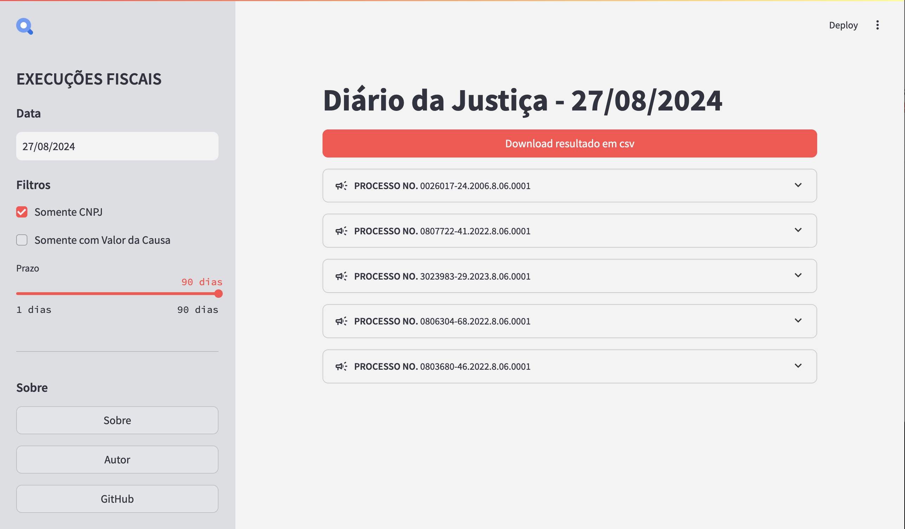

**Buscas no Diário Eletrônico da Justiça**
=====================================
Uma Ferramenta para busca de publicações específicas no Diário Eletrônico da Justiça.

### Propósito

Este projeto tem como objetivo automatizar uma etapa do processo de prospecção em um **Escritório de Advocacia**, que consiste em buscar, em publicações oficiais, dados que possam indicar que uma determinada pessoa jurídica ou pessoa física possam se interessar nos serviços do escritório.

## Fluxo dos dados

## Interface

## Autor
* [Kandarpa Galas](https://github.com/kandarpagalas/) 

